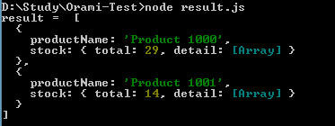
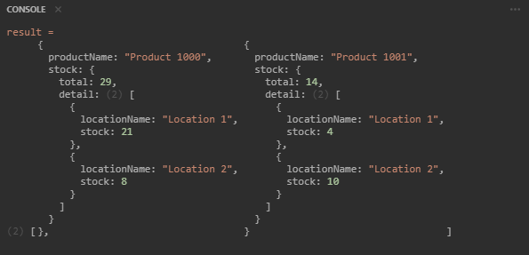

<h1 align='center'>Orami Developer Test</h1> 

## Requirements

Tulis fungsi yang mengembalikan hasil seperti di atas dengan ketentuan:
1. Gunakan bahasa pemrograman JavaScript, Python, PHP, atau pseudo-code
2. Algoritma efisien dan dapat digunakan untuk data yang besar (scalable)
3. Minimalisasi penggunaan built-in functions
4. Tambahkan 1 paragraf penjelasan mengenai solusi yang dipilih, seperti alasan, analisa, keuntungan, kerugian
5. Waktu mengerjakan up to 24 jam

## Usage for development
1. Open your terminal or command prompt
2. Type `git clone https://github.com/alghifarifikri/orami-test.git`
3. Open the folder and type `node result.js` for running the code.

## Output
  

    
      
    
    
&nbsp;&nbsp;
	Via playcode.io
      
    	
  

  
